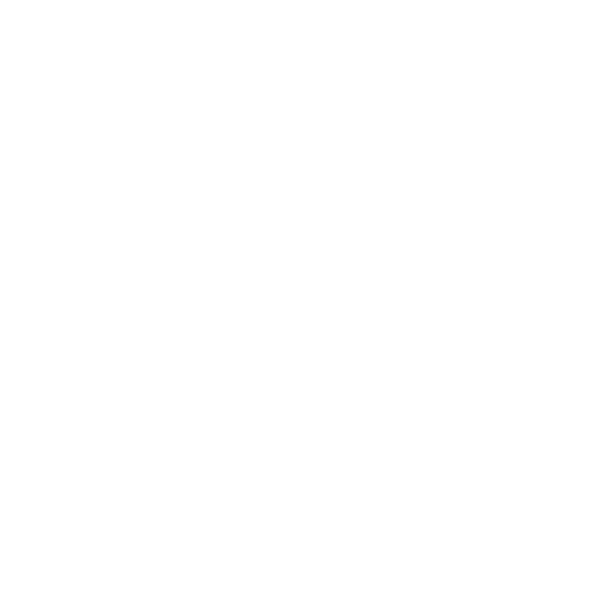
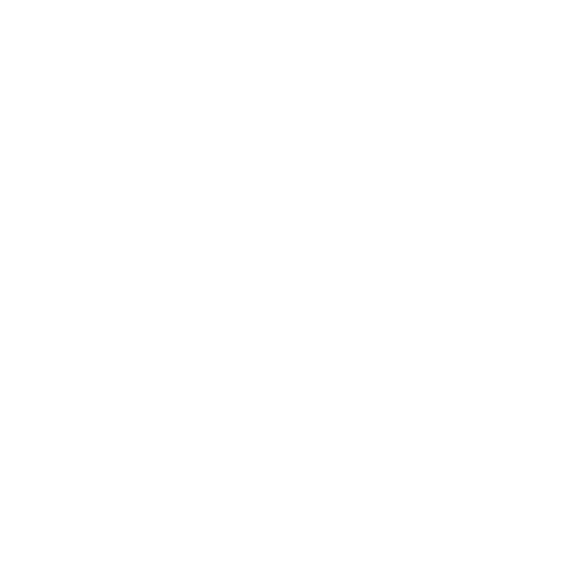

    <h1> Hello there! 🫡</h1>

I'm Moisés, a FullStack Developer 💻 with a background in Robotics 🦾, particularly focused on the industrial 🏭 sector.

My passion is learning, and if possible, sharing that knowledge with others 👥 in the best way I can.

<h3>My Skills 🥷</h3>

These are some of the technologies I'm familiar with:
 
 

 
    
    
    
    
    
    
    
     
    
    
    
    
    
    
    
    
     
    
    
    
    
    
    
    
    

 

And these are others I'm currently researching and working with

 

    
    
    
     
    
    
    
    
    

 

<h3>About my projects 💡</h3>

I have several ongoing projects, but the most significant one is the __ project. This initiative involves developing software using Tauri, aimed at monitoring, running, and editing all aspects of a project, including frontend, backend, Docker, Kubernetes, and more. Since this project is a personal endeavor, it's still a work in progress. However, once completed, I intend to showcase it more prominently here. You can explore my other noteworthy projects in the pinned section below.

<h4>Courses I do recommend: </h4>

I love to watch courses. Here are some I have purchased and where I have spent so much time for recommend it:

<h5> In english: </h5>

 
<h5> En español: </h5>

 

<h3 align="center">🚀 Connect with me 😄</h3>

 

    
    
    
    
    

